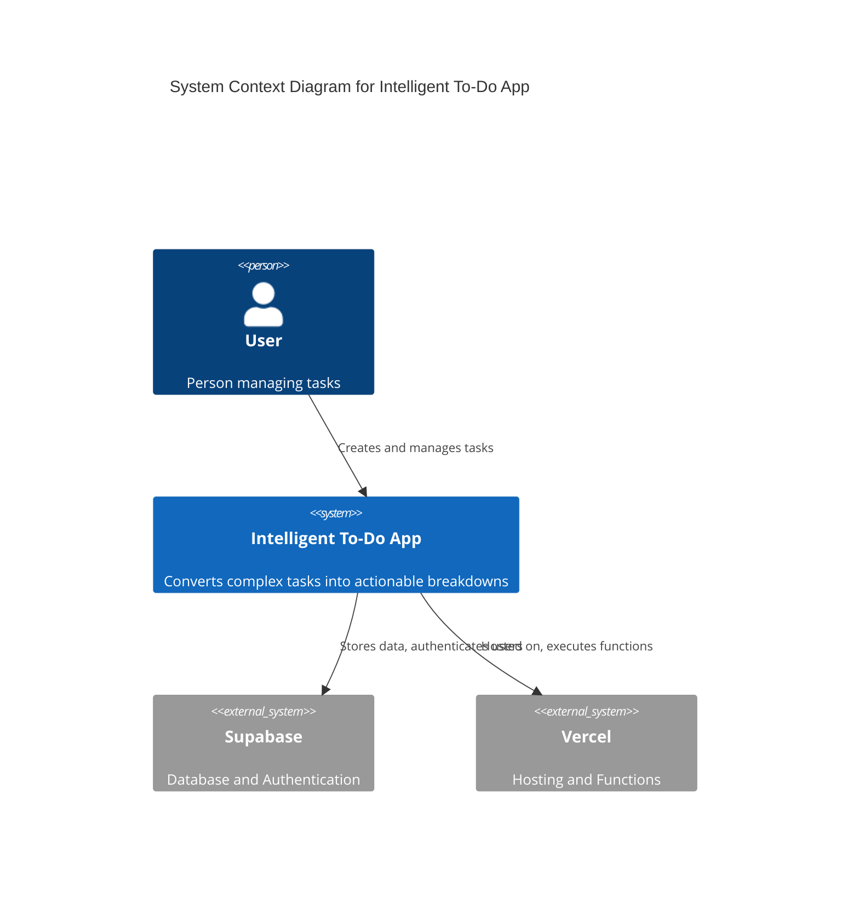

# Components

## Frontend Application

**Responsibility:** Single-page React application providing the conversational task management interface

**Key Interfaces:**
- Task input processing and display
- Real-time task updates via Supabase
- Context switching (work/personal)
- Task hierarchy visualization

**Dependencies:** Supabase client, TanStack Query, Zustand store

**Technology Stack:** React 18, TypeScript, Tailwind CSS, Vite build system

## Task Breakdown Service

**Responsibility:** Intelligent parsing and breakdown of natural language task input

**Key Interfaces:**
- Natural language processing endpoint
- Template matching and variable substitution
- Metadata extraction (dates, priorities, context)
- Hierarchical task generation

**Dependencies:** Task template library, date parsing utilities

**Technology Stack:** Vercel Functions, TypeScript, custom rule engine

## Authentication Service

**Responsibility:** User authentication and session management

**Key Interfaces:**
- Login/logout endpoints
- JWT token validation
- User registration and profile management
- Social authentication integration

**Dependencies:** Supabase Auth SDK

**Technology Stack:** Supabase Auth, JWT tokens, secure cookie management

## Database Layer

**Responsibility:** Data persistence and retrieval with real-time capabilities

**Key Interfaces:**
- Task CRUD operations
- User management
- Real-time subscriptions
- Template library access

**Dependencies:** Supabase PostgreSQL, connection pooling

**Technology Stack:** Supabase PostgreSQL, Row Level Security, real-time subscriptions

## Component Diagrams

