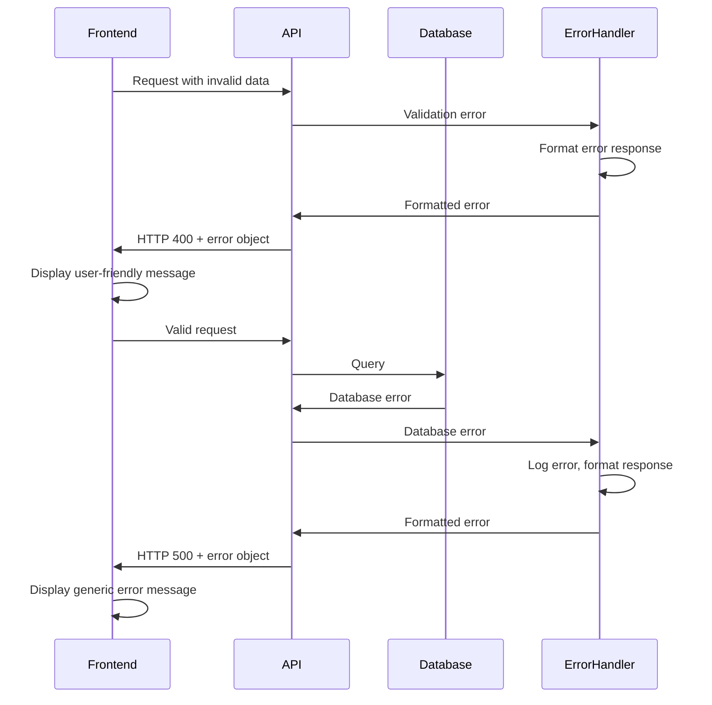

# Error Handling Strategy

## Error Flow



## Error Response Format

```typescript
interface ApiError {
  error: {
    code: string;
    message: string;
    details?: Record<string, any>;
    timestamp: string;
    requestId: string;
  };
}
```

## Frontend Error Handling

```typescript
// Global error boundary
export function GlobalErrorBoundary({ children }: { children: React.ReactNode }) {
  return (
    <ErrorBoundary
      FallbackComponent={ErrorFallback}
      onError={(error, errorInfo) => {
        console.error('Application error:', error, errorInfo);
        // Report to monitoring service
      }}
    >
      {children}
    </ErrorBoundary>
  );
}

// API error handling
export async function handleApiError(response: Response) {
  if (!response.ok) {
    const errorData = await response.json();
    throw new ApiError(errorData.error);
  }
  return response;
}

export class ApiError extends Error {
  constructor(
    public code: string,
    message: string,
    public details?: any
  ) {
    super(message);
    this.name = 'ApiError';
  }
}
```

## Backend Error Handling

```typescript
// Standard error handler for all API functions
export function withErrorHandler(handler: Function) {
  return async (req: VercelRequest, res: VercelResponse) => {
    try {
      return await handler(req, res);
    } catch (error) {
      const errorResponse = formatError(error, req);
      res.status(errorResponse.status).json(errorResponse.body);
    }
  };
}

function formatError(error: any, req: VercelRequest) {
  const requestId = req.headers['x-request-id'] || generateId();
  
  if (error instanceof ValidationError) {
    return {
      status: 400,
      body: {
        error: {
          code: 'VALIDATION_ERROR',
          message: error.message,
          details: error.details,
          timestamp: new Date().toISOString(),
          requestId
        }
      }
    };
  }
  
  if (error instanceof DatabaseError) {
    console.error('Database error:', error, { requestId });
    return {
      status: 500,
      body: {
        error: {
          code: 'DATABASE_ERROR',
          message: 'An internal error occurred',
          timestamp: new Date().toISOString(),
          requestId
        }
      }
    };
  }
  
  // Default error
  console.error('Unexpected error:', error, { requestId });
  return {
    status: 500,
    body: {
      error: {
        code: 'INTERNAL_ERROR',
        message: 'An unexpected error occurred',
        timestamp: new Date().toISOString(),
        requestId
      }
    }
  };
}
```
