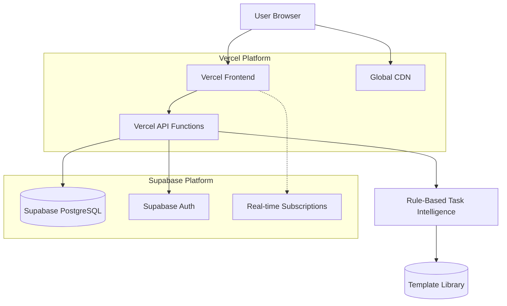
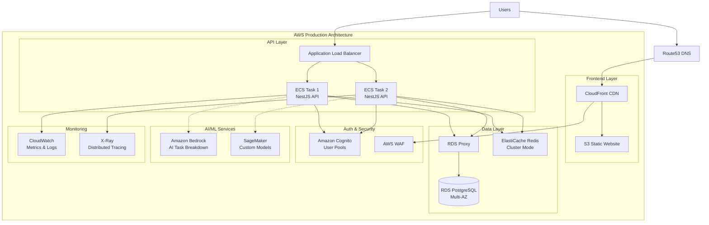

# High Level Architecture

## Technical Summary

The Intelligent To-Do App employs a **serverless-first architecture** deployed entirely on no-commitment free tiers, optimizing for zero upfront costs while maintaining the sub-2-second response requirements. The **React + TypeScript frontend** on Vercel provides the signature single-input interface, while **Vercel Functions** power the backend API with rule-based task breakdown intelligence. **Supabase** serves as the managed PostgreSQL database with built-in authentication, eliminating the need for separate auth infrastructure. This architecture supports the hybrid intelligence strategy through service abstractions that can seamlessly evolve from rule-based templates to AI integration without platform migration, directly addressing the "fulfillment over productivity" user experience through intelligent task parsing and hierarchical breakdown capabilities.

## Platform and Infrastructure Choice

**Platform:** Vercel + Supabase  
**Key Services:** Vercel Functions, Supabase PostgreSQL, Supabase Auth, Vercel CDN  
**Deployment Host and Regions:** Global edge deployment (Vercel CDN), US-East database (Supabase)

## Repository Structure

**Structure:** Monorepo with serverless-optimized organization  
**Monorepo Tool:** Native npm workspaces (simpler than Nx/Turborepo for this scale)  
**Package Organization:** Frontend app, shared types, API functions, and configuration packages

## High Level Architecture Diagram

## Architectural Patterns

- **Serverless Architecture:** Function-based API endpoints with automatic scaling - _Rationale:_ Zero infrastructure management and perfect cost scaling for MVP validation phase
- **Component-Based UI:** React functional components with TypeScript - _Rationale:_ Matches PRD requirements and provides excellent developer experience for the single-input interface
- **Database-per-Service Pattern:** Supabase as single data source with service-specific schemas - _Rationale:_ Simplified for MVP while allowing future service separation
- **API Gateway Pattern:** Vercel Functions as unified API entry point - _Rationale:_ Built-in routing, authentication, and monitoring without additional infrastructure
- **Template-Based Intelligence:** Rule engine with pattern matching templates - _Rationale:_ Delivers the core AI-like experience without API costs, preparing for future AI integration
- **Event-Driven Updates:** Supabase real-time for live task updates - _Rationale:_ Enhanced user experience for collaborative features and immediate feedback on task breakdowns

## Migration Strategy to AWS Production Architecture

### Migration Trigger Points:
- **User Scale**: Approaching 10K+ DAU (Supabase/Vercel limits)
- **Revenue Milestone**: $10K+ MRR justifies infrastructure investment
- **Feature Complexity**: Need for real-time AI processing, advanced analytics, or enterprise features
- **Performance Requirements**: Sub-200ms response times globally
- **Compliance Needs**: SOC2, HIPAA, or enterprise security requirements

### AWS Production Architecture Diagram

### Migration Timeline and Costs

**Timeline**: 6-8 weeks with 1-2 engineers
**Estimated Monthly AWS Costs** (10K DAU):

| Service | Configuration | Monthly Cost |
|---------|---------------|--------------|
| RDS PostgreSQL | db.r6g.large Multi-AZ | $400 |
| ECS Fargate | 2 vCPU, 4GB RAM x2 tasks | $120 |
| Application Load Balancer | Standard | $25 |
| CloudFront + S3 | 1TB transfer, 100GB storage | $50 |
| ElastiCache | cache.r6g.large | $200 |
| Cognito | 10K MAU | $55 |
| CloudWatch + X-Ray | Standard monitoring | $100 |
| **Total** | | **~$950/month** |
